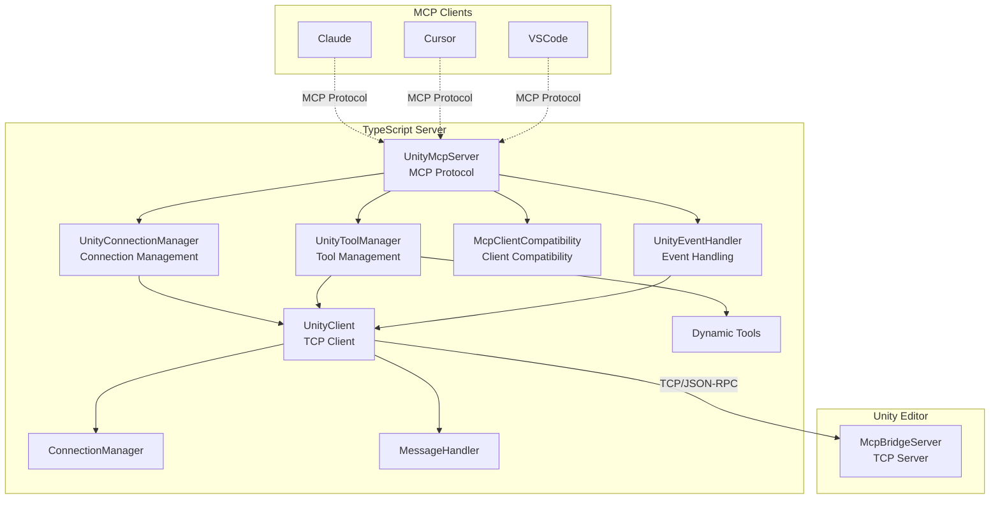
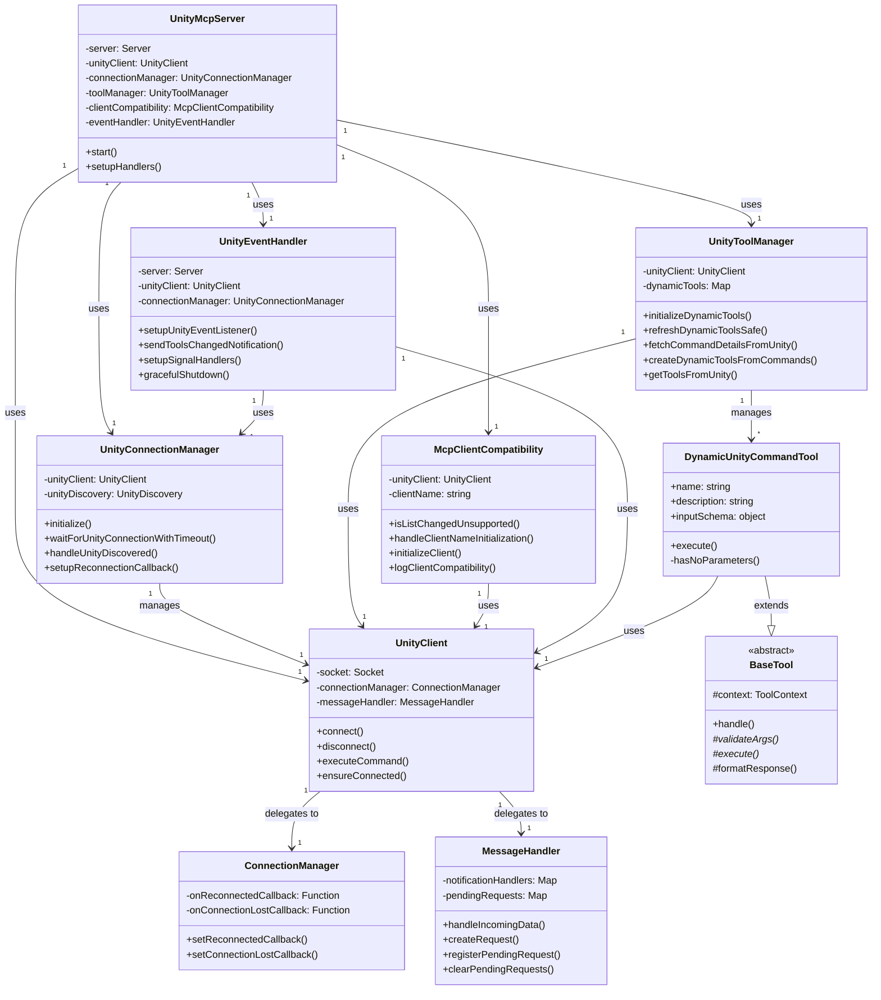
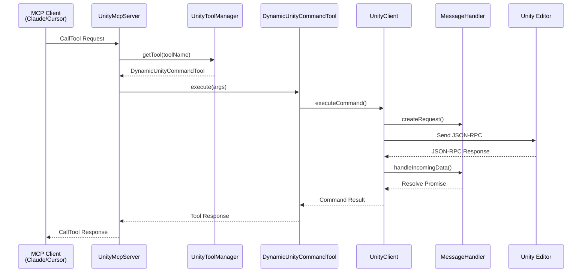

# uMCP TypeScript Server Architecture

## 1. Overview

This document outlines the architecture of the TypeScript server located in `Packages/src/TypeScriptServer`. This server acts as the intermediary between an MCP-compatible client (like Cursor, Claude, or VSCode) and the Unity Editor. It runs as a Node.js process, communicates with the client via standard I/O (stdio) using the Model Context Protocol (MCP), and relays commands to the Unity Editor via a TCP socket.

Its primary responsibilities are:
1.  **MCP Server Implementation**: Implements the MCP server specification using `@modelcontextprotocol/sdk` to handle requests from the client (e.g., `tools/list`, `tools/call`).
2.  **Dynamic Tool Management**: Fetches a list of available commands from the Unity Editor and dynamically creates corresponding "tools" to expose to the MCP client.
3.  **Unity Communication**: Manages a persistent TCP connection to the `McpBridgeServer` running inside the Unity Editor.
4.  **Command Forwarding**: Translates `tools/call` requests from the MCP client into JSON-RPC requests and sends them to the Unity server for execution.
5.  **Notification Handling**: Listens for `notifications/tools/list_changed` events from Unity to automatically refresh its toolset when commands are added or removed in the Unity project.

## 2. Architecture Diagrams

### 2.1. System Overview

### 2.2. Class Relationships

### 2.3. Command Execution Sequence

## 3. Core Architectural Principles

### 3.1. Dynamic and Extensible Tooling
The server's core strength is its ability to dynamically adapt to the tools (commands) available in Unity.

- **`UnityToolManager`**: Now handles all dynamic tool management through dedicated methods:
  - `initializeDynamicTools()`: Orchestrates the tool initialization process
  - `fetchCommandDetailsFromUnity()`: Retrieves command metadata from Unity
  - `createDynamicToolsFromCommands()`: Creates tool instances from metadata
  - `refreshDynamicToolsSafe()`: Safely refreshes tools with duplicate prevention
- **`McpClientCompatibility`**: Manages client-specific requirements:
  - `handleClientNameInitialization()`: Manages client name synchronization
  - `isListChangedUnsupported()`: Detects clients that don't support list_changed notifications
- **`DynamicUnityCommandTool.ts`**: This class is a generic "tool" factory. It takes the schema information received from Unity (name, description, parameters) and constructs an MCP-compliant tool on the fly. Now includes `hasNoParameters()` method for cleaner conditional logic.
- This means that when a Unity developer adds a new `IUnityCommand` to their project, the TypeScript server automatically discovers it and exposes it to the LLM tool without requiring any changes to the TypeScript code.

### 3.2. Decoupling and Single Responsibility
The architecture follows Martin Fowler's Extract Class pattern for clean separation of responsibilities:

- **`server.ts` (`UnityMcpServer`)**: The main application entry point, now focused solely on MCP protocol handling and component orchestration. Delegates specific responsibilities to specialized managers.
- **`unity-connection-manager.ts` (`UnityConnectionManager`)**: Manages Unity connection lifecycle, discovery, and reconnection logic. Provides a clean abstraction over the connection complexity.
- **`unity-tool-manager.ts` (`UnityToolManager`)**: Handles all aspects of dynamic tool management, from fetching Unity commands to creating and refreshing tool instances.
- **`mcp-client-compatibility.ts` (`McpClientCompatibility`)**: Manages client-specific behaviors and compatibility requirements, particularly for clients that don't support list_changed notifications.
- **`unity-event-handler.ts` (`UnityEventHandler`)**: Handles event processing, notifications, signal handling, and graceful shutdown procedures.
- **`unity-client.ts` (`UnityClient`)**: Manages the TCP connection to the Unity Editor. Delegates specific responsibilities to:
  - **`connection-manager.ts` (`ConnectionManager`)**: Handles connection state management
  - **`message-handler.ts` (`MessageHandler`)**: Processes JSON-RPC message parsing and routing
- **`dynamic-unity-command-tool.ts` (`DynamicUnityCommandTool`)**: Responsible for the logic of a single, dynamically-generated tool.
- **`base-tool.ts` (`BaseTool`)**: Abstract base class implementing the Template Method pattern for all tools.

### 3.3. Resilience and Robustness
The server is designed to be resilient to connection drops and process lifecycle events.

- **Connection Management**: `UnityConnectionManager` orchestrates the connection lifecycle through `UnityDiscovery` (singleton pattern prevents multiple timers). If the connection to Unity is lost (e.g., Unity Editor is closed or crashes), it periodically attempts to reconnect, ensuring the bridge is re-established automatically when Unity becomes available again.
- **Graceful Shutdown**: `UnityEventHandler` handles all signal processing (`SIGINT`, `SIGTERM`, `SIGHUP`) and monitors `stdin` to ensure graceful shutdown. When the parent process (the LLM tool) terminates, the Node.js server cleans up its connections and exits, preventing orphaned processes.
- **Client Compatibility**: `McpClientCompatibility` manages different client behaviors, ensuring proper initialization for clients that don't support list_changed notifications (Claude Code, Gemini, Windsurf).
- **Safe Timers**: The `safe-timer.ts` utility provides `setTimeout` and `setInterval` wrappers that automatically clear themselves when the process exits, further preventing hangs and orphaned processes.
- **Delayed Unity Connection**: The server waits for the MCP client to provide its name before connecting to Unity, preventing "Unknown Client" from appearing in the Unity UI. This ensures the client is properly identified from the first connection.

### 3.4. Safe Logging
Because the server uses `stdio` for JSON-RPC communication, `console.log` cannot be used for debugging as it would corrupt the protocol stream.
- **`log-to-file.ts`**: This utility provides a safe, file-based logging mechanism. When the `MCP_DEBUG` environment variable is set, all debug, info, warning, and error messages are written to a timestamped log file in the user's home directory (`~/.claude/umcp-logs/`), keeping `stdout` clean for protocol messages.

## 4. Key Components (File Breakdown)

### `src/server.ts`
This is the main entry point of the application, now significantly simplified through Martin Fowler's Extract Class refactoring.
- **`UnityMcpServer` class**:
    - Initializes the `@modelcontextprotocol/sdk` `Server`.
    - Instantiates and orchestrates the specialized manager classes:
        - `UnityConnectionManager`: For connection lifecycle management
        - `UnityToolManager`: For dynamic tool management
        - `McpClientCompatibility`: For client-specific behavior handling
        - `UnityEventHandler`: For event processing and shutdown
    - On `start()`, it delegates initialization to the appropriate managers.
    - Sets up request handlers including `InitializeRequestSchema` which triggers client-specific initialization.
    - Handles `ListToolsRequestSchema` and `CallToolRequestSchema` by delegating to `UnityToolManager`.
        - The `ListTools` handler delegates to `toolManager.getAllTools()`.
        - The `CallTool` handler delegates to the appropriate tool via `toolManager.getTool()`.
    - Event listening and notification handling is delegated to `UnityEventHandler`.

### `src/unity-connection-manager.ts`
Manages the Unity connection lifecycle with a focus on discovery and reconnection.
- **`UnityConnectionManager` class**:
    - Orchestrates Unity connection establishment through `UnityDiscovery`.
    - Provides `waitForUnityConnectionWithTimeout()` for synchronous initialization.
    - Handles connection callbacks and manages reconnection scenarios.
    - Integrates with the singleton `UnityDiscovery` service to prevent timer conflicts.

### `src/unity-tool-manager.ts`
Handles all aspects of dynamic tool management and lifecycle.
- **`UnityToolManager` class**:
    - `initializeDynamicTools()`: Fetches Unity commands and creates corresponding tools.
    - `refreshDynamicToolsSafe()`: Safely refreshes tools with duplicate prevention.
    - `fetchCommandDetailsFromUnity()`: Retrieves command metadata from Unity.
    - `createDynamicToolsFromCommands()`: Creates tool instances from Unity schemas.
    - Manages the `dynamicTools` Map and provides tool access methods.

### `src/mcp-client-compatibility.ts`
Manages client-specific compatibility and behavior differences.
- **`McpClientCompatibility` class**:
    - `isListChangedUnsupported()`: Detects clients that don't support list_changed notifications.
    - `handleClientNameInitialization()`: Manages client name setup and environment variable fallbacks.
    - `initializeClient()`: Orchestrates client-specific initialization procedures.
    - Handles compatibility for Claude Code, Gemini, and Windsurf clients.

### `src/unity-event-handler.ts`
Manages event processing, notifications, and graceful shutdown.
- **`UnityEventHandler` class**:
    - `setupUnityEventListener()`: Configures Unity notification listeners.
    - `sendToolsChangedNotification()`: Sends MCP list_changed notifications with duplicate prevention.
    - `setupSignalHandlers()`: Configures process signal handlers for graceful shutdown.
    - `gracefulShutdown()`: Handles cleanup and process termination.

### `src/unity-client.ts`
This class encapsulates all communication with the Unity Editor.
- **`UnityClient` class**:
    - Manages a `net.Socket` for TCP communication.
    - The `connect()` method establishes the connection, while `ensureConnected()` provides a resilient way to get a valid connection, reconnecting if necessary.
    - `executeCommand()` is the primary method for sending a JSON-RPC request to Unity. It constructs the request, sends it over the socket, and waits for a response with a matching ID.
    - It handles incoming data, distinguishing between responses to its requests and asynchronous notifications from the server (like `notifications/tools/list_changed`).

### `src/tools/`
This directory contains the logic for the tools exposed to the MCP client.
- **`dynamic-unity-command-tool.ts`**: The factory for tools based on Unity commands. Its `generateInputSchema()` method is crucial, as it translates the C# schema definition into a JSON Schema format that the MCP client can understand.
- **Other tool files** (e.g., `ping-tool.ts`): These are static tools that are always available, independent of what commands are defined in Unity.

### `src/utils/`
Contains helper utilities.
- **`log-to-file.ts`**: Provides the safe, file-based logging functions (`debugToFile`, `infoToFile`, etc.).
- **`safe-timer.ts`**: Provides the `SafeTimer` class and `safeSetTimeout`/`safeSetInterval` functions for robust timer management.

### `src/constants.ts`
A central file for all shared constants, including MCP protocol constants (previously in `mcp-constants.ts`), environment variables, default messages, and timeout values. This ensures consistency across the application.

## 4. Key Workflows

### Server Startup and Tool Initialization
1.  `UnityMcpServer` is instantiated.
2.  Specialized manager classes are instantiated:
    - `UnityConnectionManager` (with `UnityClient`)
    - `UnityToolManager`
    - `McpClientCompatibility`
    - `UnityEventHandler`
3.  `UnityMcpServer.start()` is called.
4.  `UnityEventHandler.setupUnityEventListener()` configures notification listeners.
5.  `UnityConnectionManager.initialize()` starts the connection discovery process.
6.  The MCP server connects to the `StdioServerTransport`, ready to serve requests from the client.
7.  The server waits for an `initialize` request from the MCP client.
8.  Upon receiving the `initialize` request:
    - Client name is extracted from `clientInfo.name` if provided.
    - `McpClientCompatibility.setClientName()` stores the client information.
    - `McpClientCompatibility.logClientCompatibility()` logs client-specific behavior.
    - Based on client compatibility, either synchronous or asynchronous initialization is used.
9.  For synchronous initialization (list_changed unsupported clients):
    - `UnityConnectionManager.waitForUnityConnectionWithTimeout()` waits for Unity.
    - `UnityToolManager.getToolsFromUnity()` fetches and returns tools immediately.
10. For asynchronous initialization (list_changed supported clients):
    - `UnityToolManager.initializeDynamicTools()` starts background initialization.
    - Tools are discovered and `UnityEventHandler.sendToolsChangedNotification()` notifies the client.
11. `UnityToolManager.fetchCommandDetailsFromUnity()` retrieves command schemas from Unity.
12. `UnityToolManager.createDynamicToolsFromCommands()` creates tool instances from the schemas.

### Handling a Tool Call
1.  The MCP client (e.g., Cursor) sends a `tools/call` request via `stdin`.
2.  `UnityMcpServer`'s `CallToolRequestSchema` handler is invoked.
3.  It calls `UnityToolManager.hasTool()` to check if the requested tool exists.
4.  It calls `UnityToolManager.getTool()` to retrieve the corresponding `DynamicUnityCommandTool` instance.
5.  It calls the `execute()` method on the tool instance.
6.  The tool's `execute()` method calls `this.context.unityClient.executeCommand()` with the tool name and arguments.
7.  `UnityClient` sends the JSON-RPC request to Unity over TCP.
8.  Unity executes the command and sends a response back.
9.  `UnityClient` receives the response and resolves the promise, returning the result to the tool.
10. The tool formats the result into an MCP-compliant response and returns it.
11. `UnityMcpServer` sends the final response to the client via `stdout`.

## 5. Recent Architectural Improvements (Martin Fowler Refactoring)

### 5.1. Extract Class Pattern Implementation
In recent updates, the monolithic `server.ts` (671 lines) was refactored using Martin Fowler's Extract Class pattern to improve maintainability and code organization. This resulted in a 58% reduction in the main server file size (282 lines) while enhancing functional cohesion.

### 5.2. Extracted Classes and Their Responsibilities

#### UnityConnectionManager
- **Purpose**: Single responsibility for Unity connection lifecycle management
- **Key Features**: Connection discovery, timeout handling, reconnection callbacks
- **Cohesion**: Functional cohesion - all methods relate to connection management

#### UnityToolManager  
- **Purpose**: Single responsibility for dynamic tool lifecycle management
- **Key Features**: Tool creation, refresh management, Unity command integration
- **Cohesion**: Functional cohesion - all methods relate to tool management

#### McpClientCompatibility
- **Purpose**: Single responsibility for client-specific compatibility handling
- **Key Features**: list_changed support detection, client name management, environment variable fallbacks
- **Cohesion**: Functional cohesion - all methods relate to client compatibility

#### UnityEventHandler
- **Purpose**: Single responsibility for event processing and graceful shutdown
- **Key Features**: Signal handling, notification management, process cleanup
- **Cohesion**: Functional cohesion - all methods relate to event handling

### 5.3. Benefits Achieved
- **Maintainability**: Each class has a clear, focused purpose making future changes easier
- **Testability**: Smaller, focused classes are easier to unit test
- **Reusability**: Extracted classes can be reused across different contexts
- **Readability**: Code organization follows single responsibility principle
- **Robustness**: Better error isolation and handling within each specialized class
