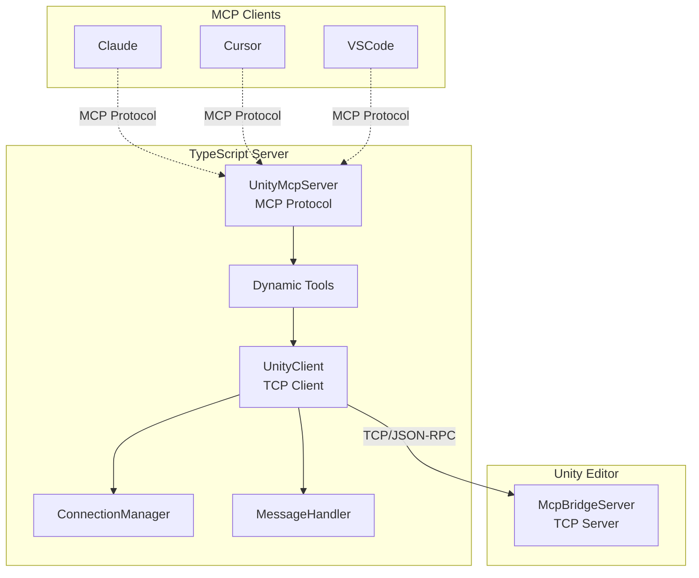
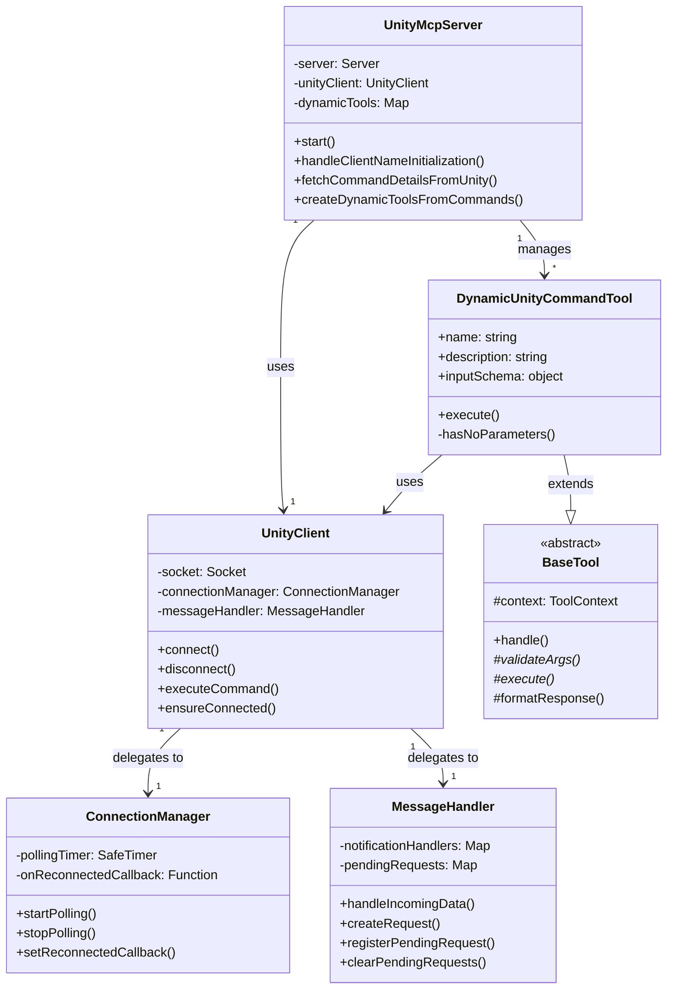
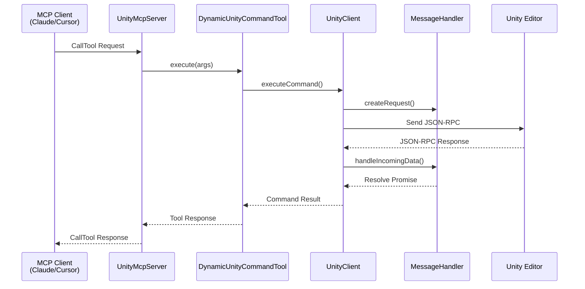

# uMCP TypeScript Server Architecture

## 1. Overview

This document outlines the architecture of the TypeScript server located in `Packages/src/TypeScriptServer`. This server acts as the intermediary between an MCP-compatible client (like Cursor, Claude, or VSCode) and the Unity Editor. It runs as a Node.js process, communicates with the client via standard I/O (stdio) using the Model Context Protocol (MCP), and relays commands to the Unity Editor via a TCP socket.

Its primary responsibilities are:
1.  **MCP Server Implementation**: Implements the MCP server specification using `@modelcontextprotocol/sdk` to handle requests from the client (e.g., `tools/list`, `tools/call`).
2.  **Dynamic Tool Management**: Fetches a list of available commands from the Unity Editor and dynamically creates corresponding "tools" to expose to the MCP client.
3.  **Unity Communication**: Manages a persistent TCP connection to the `McpBridgeServer` running inside the Unity Editor.
4.  **Command Forwarding**: Translates `tools/call` requests from the MCP client into JSON-RPC requests and sends them to the Unity server for execution.
5.  **Notification Handling**: Listens for `notifications/tools/list_changed` events from Unity to automatically refresh its toolset when commands are added or removed in the Unity project.

## 2. Architecture Diagrams

### 2.1. System Overview

### 2.2. Class Relationships

### 2.3. Command Execution Sequence

## 3. Core Architectural Principles

### 3.1. Dynamic and Extensible Tooling
The server's core strength is its ability to dynamically adapt to the tools (commands) available in Unity.

- **`UnityMcpServer.initializeDynamicTools()`**: On startup, this method connects to Unity and calls the `getCommandDetails` command. This method has been refactored into smaller, focused methods:
  - `handleClientNameInitialization()`: Manages client name synchronization
  - `fetchCommandDetailsFromUnity()`: Retrieves command metadata from Unity
  - `createDynamicToolsFromCommands()`: Creates tool instances from metadata
- **`DynamicUnityCommandTool.ts`**: This class is a generic "tool" factory. It takes the schema information received from Unity (name, description, parameters) and constructs an MCP-compliant tool on the fly. Now includes `hasNoParameters()` method for cleaner conditional logic.
- This means that when a Unity developer adds a new `IUnityCommand` to their project, the TypeScript server automatically discovers it and exposes it to the LLM tool without requiring any changes to the TypeScript code.

### 3.2. Decoupling and Single Responsibility
The architecture is cleanly separated into distinct responsibilities:

- **`server.ts` (`UnityMcpServer`)**: The main application entry point (renamed from `SimpleMcpServer` for clarity). It is responsible for the MCP-facing communication (handling `tools/list` and `tools/call`) and orchestrating the other components.
- **`unity-client.ts` (`UnityClient`)**: Manages the TCP connection to the Unity Editor. Now delegates specific responsibilities to:
  - **`connection-manager.ts` (`ConnectionManager`)**: Handles connection state and reconnection polling
  - **`message-handler.ts` (`MessageHandler`)**: Processes JSON-RPC message parsing and routing
- **`dynamic-unity-command-tool.ts` (`DynamicUnityCommandTool`)**: Responsible for the logic of a single, dynamically-generated tool.
- **`base-tool.ts` (`BaseTool`)**: Abstract base class implementing the Template Method pattern for all tools.

### 3.3. Resilience and Robustness
The server is designed to be resilient to connection drops and process lifecycle events.

- **Connection Polling**: `ConnectionManager` now handles the polling mechanism (extracted from `UnityClient`). If the connection to Unity is lost (e.g., Unity Editor is closed or crashes), it periodically attempts to reconnect, ensuring the bridge is re-established automatically when Unity becomes available again.
- **Graceful Shutdown**: `UnityMcpServer` includes signal handlers (`SIGINT`, `SIGTERM`, `SIGHUP`) and monitors `stdin` to ensure a graceful shutdown. When the parent process (the LLM tool) terminates, the Node.js server cleans up its connections and exits, preventing orphaned processes.
- **Safe Timers**: The `safe-timer.ts` utility provides `setTimeout` and `setInterval` wrappers that automatically clear themselves when the process exits, further preventing hangs and orphaned processes.
- **Delayed Unity Connection**: The server now waits for the MCP client to provide its name before connecting to Unity, preventing "Unknown Client" from appearing in the Unity UI. This ensures the client is properly identified from the first connection.

### 3.4. Safe Logging
Because the server uses `stdio` for JSON-RPC communication, `console.log` cannot be used for debugging as it would corrupt the protocol stream.
- **`log-to-file.ts`**: This utility provides a safe, file-based logging mechanism. When the `MCP_DEBUG` environment variable is set, all debug, info, warning, and error messages are written to a timestamped log file in the user's home directory (`~/.claude/umcp-logs/`), keeping `stdout` clean for protocol messages.

## 4. Key Components (File Breakdown)

### `src/server.ts`
This is the main entry point of the application.
- **`UnityMcpServer` class**:
    - Initializes the `@modelcontextprotocol/sdk` `Server`.
    - Instantiates the `UnityClient`.
    - On `start()`, it connects to the MCP transport and waits for client initialization.
    - Sets up request handlers including `InitializeRequestSchema` which triggers Unity connection.
    - After receiving client information, it calls `initializeDynamicTools()` to fetch commands from Unity.
    - It then handles `ListToolsRequestSchema` and `CallToolRequestSchema`.
        - The `ListTools` handler returns the list of all registered tools (static and dynamic).
        - The `CallTool` handler finds the appropriate tool and executes it.
    - It listens for `notifications/tools/list_changed` from the `UnityClient` and triggers `refreshDynamicToolsSafe()` to update its toolset.
    - Manages the graceful shutdown procedure.

### `src/unity-client.ts`
This class encapsulates all communication with the Unity Editor.
- **`UnityClient` class**:
    - Manages a `net.Socket` for TCP communication.
    - The `connect()` method establishes the connection, while `ensureConnected()` provides a resilient way to get a valid connection, reconnecting if necessary.
    - `executeCommand()` is the primary method for sending a JSON-RPC request to Unity. It constructs the request, sends it over the socket, and waits for a response with a matching ID.
    - It handles incoming data, distinguishing between responses to its requests and asynchronous notifications from the server (like `notifications/tools/list_changed`).
    - Implements the connection recovery polling logic.

### `src/tools/`
This directory contains the logic for the tools exposed to the MCP client.
- **`dynamic-unity-command-tool.ts`**: The factory for tools based on Unity commands. Its `generateInputSchema()` method is crucial, as it translates the C# schema definition into a JSON Schema format that the MCP client can understand.
- **Other tool files** (e.g., `ping-tool.ts`): These are static tools that are always available, independent of what commands are defined in Unity.

### `src/utils/`
Contains helper utilities.
- **`log-to-file.ts`**: Provides the safe, file-based logging functions (`debugToFile`, `infoToFile`, etc.).
- **`safe-timer.ts`**: Provides the `SafeTimer` class and `safeSetTimeout`/`safeSetInterval` functions for robust timer management.

### `src/constants.ts`
A central file for all shared constants, including MCP protocol constants (previously in `mcp-constants.ts`), environment variables, default messages, and timeout values. This ensures consistency across the application.

## 4. Key Workflows

### Server Startup and Tool Initialization
1.  `UnityMcpServer` is instantiated.
2.  `UnityClient` is instantiated.
3.  `UnityMcpServer.start()` is called.
4.  The MCP server connects to the `StdioServerTransport`, ready to serve requests from the client.
5.  The server waits for an `initialize` request from the MCP client.
6.  Upon receiving the `initialize` request:
    - Client name is extracted from `clientInfo.name` if provided.
    - `initializeDynamicTools()` is called for the first time.
7.  `UnityClient.ensureConnected()` establishes a TCP connection to the Unity Editor.
8.  Client name is immediately sent to Unity via `setClientName()`.
9.  `UnityClient.executeCommand('getCommandDetails', ...)` is sent to Unity.
10. Unity's `UnityCommandRegistry` gathers all `IUnityCommand` implementations and returns their schemas.
11. Back in `UnityMcpServer`, the response is received, and it iterates through the command details.
12. For each command, a new `DynamicUnityCommandTool` instance is created and stored in the `dynamicTools` map.

### Handling a Tool Call
1.  The MCP client (e.g., Cursor) sends a `tools/call` request via `stdin`.
2.  `UnityMcpServer`'s `CallToolRequestSchema` handler is invoked.
3.  It checks if the requested tool name exists in its `dynamicTools` map.
4.  It calls the `execute()` method on the corresponding `DynamicUnityCommandTool` instance.
5.  The tool's `execute()` method calls `this.context.unityClient.executeCommand()` with the tool name and arguments.
6.  `UnityClient` sends the JSON-RPC request to Unity over TCP.
7.  Unity executes the command and sends a response back.
8.  `UnityClient` receives the response and resolves the promise, returning the result to the tool.
9.  The tool formats the result into an MCP-compliant response and returns it.
10. `UnityMcpServer` sends the final response to the client via `stdout`.
