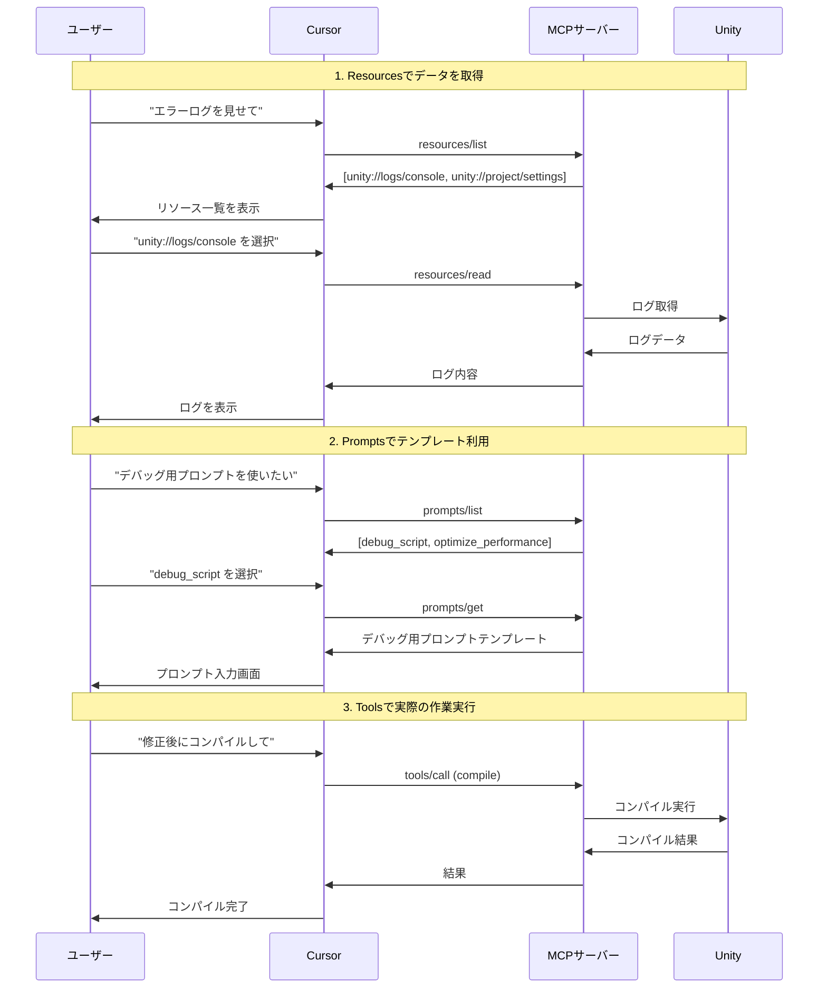
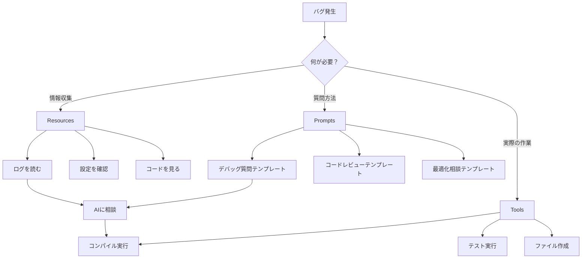
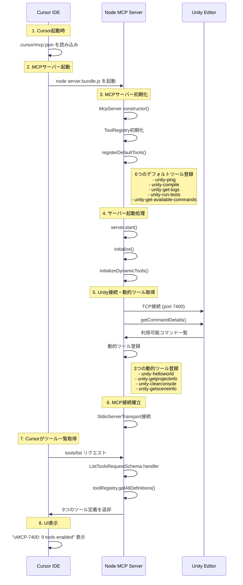
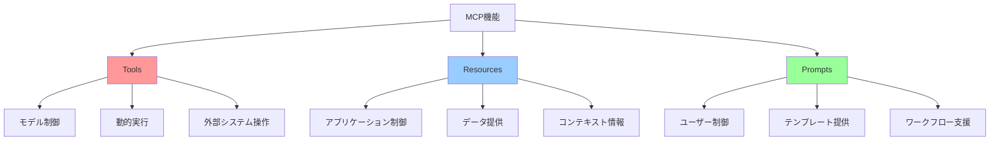
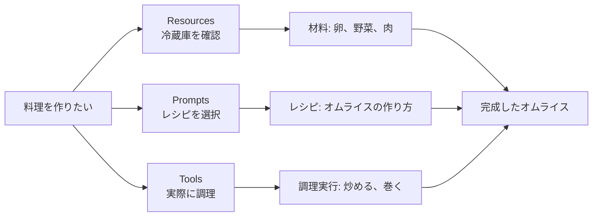

# Model Context Protocol (MCP) 仕様書

## 概要

Model Context Protocol (MCP) は、LLMアプリケーションと外部データソース・ツール間の標準化された通信プロトコルです。JSON-RPC 2.0メッセージを使用してクライアント（Cursor等）とサーバー間でやり取りを行います。

## 基本アーキテクチャ

```
Cursor (Host) → MCP Client → MCP Server → Unity/External System
```

- **Host**: LLMアプリケーション（Cursor等）
- **Client**: Host内のMCP接続コンポーネント
- **Server**: コンテキストと機能を提供するサービス

## 3つの主要機能

### 1. Tools（ツール）- 「実際に作業する」

**制御**: モデル制御（AIが自動判断・実行）
**目的**: 外部システムでの操作実行

#### 特徴
- 動的実行・操作
- システム状態の変更
- 副作用あり（ファイル作成、コンパイル等）

#### プロトコルメッセージ

**ツール一覧取得**:
```json
// Request
{
  "jsonrpc": "2.0",
  "id": 1,
  "method": "tools/list",
  "params": {
    "cursor": "optional-cursor-value"
  }
}

// Response
{
  "jsonrpc": "2.0",
  "id": 1,
  "result": {
    "tools": [
      {
        "name": "unity-compile",
        "description": "Execute Unity project compilation",
        "inputSchema": {
          "type": "object",
          "properties": {
            "target": { "type": "string" }
          }
        }
      }
    ]
  }
}
```

**ツール実行**:
```json
// Request
{
  "jsonrpc": "2.0",
  "id": 2,
  "method": "tools/call",
  "params": {
    "name": "unity-compile",
    "arguments": {
      "target": "StandaloneWindows"
    }
  }
}

// Response
{
  "jsonrpc": "2.0",
  "id": 2,
  "result": {
    "content": [
      {
        "type": "text",
        "text": "Compilation completed successfully"
      }
    ],
    "isError": false
  }
}
```

### 2. Resources（リソース）- 「情報を見る」

**制御**: アプリケーション制御（ユーザーが選択）
**目的**: データやコンテンツの読み取り専用提供

#### 特徴
- 読み取り専用
- 静的な情報（ファイル、設定、ログ等）
- 副作用なし

#### リソースURI形式
```
[protocol]://[host]/[path]
```

例:
- `unity://logs/console` - Unityコンソールログ
- `unity://project/settings` - プロジェクト設定
- `unity://scene/current` - 現在のシーン情報

#### プロトコルメッセージ

**リソース一覧取得**:
```json
// Request
{
  "jsonrpc": "2.0",
  "id": 1,
  "method": "resources/list"
}

// Response
{
  "jsonrpc": "2.0",
  "id": 1,
  "result": {
    "resources": [
      {
        "uri": "unity://logs/console",
        "name": "Unity Console Logs",
        "description": "Recent Unity console output",
        "mimeType": "text/plain",
        "size": 1024
      }
    ]
  }
}
```

**リソース読み取り**:
```json
// Request
{
  "jsonrpc": "2.0",
  "id": 2,
  "method": "resources/read",
  "params": {
    "uri": "unity://logs/console"
  }
}

// Response
{
  "jsonrpc": "2.0",
  "id": 2,
  "result": {
    "contents": [
      {
        "uri": "unity://logs/console",
        "mimeType": "text/plain",
        "text": "2025-01-01 10:00:00 INFO: Application started\n2025-01-01 10:00:01 ERROR: NullReferenceException"
      }
    ]
  }
}
```

### 3. Prompts（プロンプト）- 「質問の仕方を教える」

**制御**: ユーザー制御（ユーザーが選択）
**目的**: 事前定義されたプロンプトテンプレートの提供

#### 特徴
- テンプレート化された質問パターン
- パラメータ化対応
- ワークフロー支援

#### プロトコルメッセージ

**プロンプト一覧取得**:
```json
// Request
{
  "jsonrpc": "2.0",
  "id": 1,
  "method": "prompts/list"
}

// Response
{
  "jsonrpc": "2.0",
  "id": 1,
  "result": {
    "prompts": [
      {
        "name": "debug_script",
        "description": "Debug Unity C# script issues",
        "arguments": [
          {
            "name": "script_content",
            "description": "The C# script to debug",
            "required": true
          },
          {
            "name": "error_message",
            "description": "Error message from Unity console",
            "required": false
          }
        ]
      }
    ]
  }
}
```

**プロンプト取得**:
```json
// Request
{
  "jsonrpc": "2.0",
  "id": 2,
  "method": "prompts/get",
  "params": {
    "name": "debug_script",
    "arguments": {
      "script_content": "public class PlayerController : MonoBehaviour { ... }",
      "error_message": "NullReferenceException at line 42"
    }
  }
}

// Response
{
  "jsonrpc": "2.0",
  "id": 2,
  "result": {
    "description": "Unity C# script debugging assistant",
    "messages": [
      {
        "role": "user",
        "content": {
          "type": "text",
          "text": "Please help debug this Unity C# script:\n\npublic class PlayerController : MonoBehaviour { ... }\n\nError message: NullReferenceException at line 42\n\nFocus on common Unity-specific issues like:\n- MonoBehaviour lifecycle\n- Null reference exceptions\n- Performance issues\n- Memory leaks"
        }
      }
    ]
  }
}
```

## 通知機能

### ツール一覧変更通知
```json
{
  "jsonrpc": "2.0",
  "method": "notifications/tools/list_changed"
}
```

### リソース変更通知
```json
{
  "jsonrpc": "2.0",
  "method": "notifications/resources/list_changed"
}
```

### リソース更新通知
```json
{
  "jsonrpc": "2.0",
  "method": "notifications/resources/updated",
  "params": {
    "uri": "unity://logs/console"
  }
}
```

## Cursorの起動フロー

1. **Cursor起動時**: `.cursor/mcp.json`を読み込み
2. **MCPサーバー起動**: `node server.bundle.js`を実行
3. **サーバー初期化**: ToolRegistry初期化、デフォルトツール登録
4. **Unity接続**: TCP接続確立、動的ツール取得
5. **MCP接続**: StdioServerTransport接続
6. **ツール一覧取得**: Cursorが`tools/list`リクエスト送信
7. **UI表示**: "uMCP-7400: 9 tools enabled"表示

## 3つの機能の使い分け

| 機能 | 制御者 | 目的 | 使用例 | 副作用 |
|------|--------|------|--------|--------|
| **Tools** | モデル | 動的実行・操作 | コンパイル、テスト実行 | あり |
| **Resources** | アプリケーション | データ提供 | ログファイル、設定情報 | なし |
| **Prompts** | ユーザー | テンプレート | コードレビュー、デバッグ支援 | なし |

## 実装における設計指針

### Tools実装
- 実際の操作を実行する機能
- エラーハンドリングを適切に実装
- 実行結果を明確に返却

### Resources実装
- 読み取り専用でデータを提供
- 適切なMIMEタイプを設定
- URIスキームを一貫性を持って設計

### Prompts実装
- 再利用可能なテンプレートを設計
- パラメータ化で柔軟性を確保
- ユーザーフレンドリーな説明を提供

## セキュリティ考慮事項

1. **入力検証**: すべてのパラメータを適切に検証
2. **アクセス制御**: 適切な権限チェックを実装
3. **レート制限**: 過度なリクエストを制限
4. **エラー処理**: 内部エラーを外部に漏らさない
5. **ログ監査**: セキュリティ関連イベントを記録

## Unity MCP実装例

### 現在の実装（Tools のみ）
- unity-ping: Unity接続テスト
- unity-compile: コンパイル実行
- unity-get-logs: ログ取得
- unity-run-tests: テスト実行
- unity-get-available-commands: コマンド一覧取得
- 動的ツール: Unity側で定義されたカスタムコマンド

### 拡張案（Resources + Prompts）
- **Resources**: プロジェクト設定、シーン情報、ログファイル
- **Prompts**: デバッグ支援、コードレビュー、パフォーマンス最適化

## 実際の使用シーン例

### シナリオ：Unity開発でバグを修正したい場合



### 3つの機能の役割分担



### 具体的な使用例

#### 1. Resources使用例
```
ユーザー: "エラーログを見せて"
→ Cursor: unity://logs/console リソースを表示
→ 結果: "NullReferenceException at PlayerController.cs:42"
```

#### 2. Prompts使用例
```
ユーザー: "デバッグ用プロンプトを使いたい"
→ Cursor: debug_script プロンプトを選択
→ 結果: "このC#スクリプトをデバッグしてください：[コード] エラー：[NullReferenceException]"
```

#### 3. Tools使用例
```
AI: "修正が必要です。コンパイルしましょう"
→ Cursor: unity-compile ツールを自動実行
→ 結果: "コンパイル完了"
```

## MCPサーバー起動フロー詳細



## 3つの機能比較図



## 料理に例えた説明

MCPの3つの機能を料理に例えると：

- **Resources**: 冷蔵庫の中身を見る（材料確認）
- **Prompts**: レシピ本を見る（作り方のテンプレート）
- **Tools**: 実際に料理する（調理実行）

全部「料理を作る」という目的だが、それぞれ役割が違う：



## 参考資料

- [MCP公式仕様](https://modelcontextprotocol.io/specification/)
- [MCP TypeScript SDK](https://github.com/modelcontextprotocol/typescript-sdk)
- [Unity MCP Bridge実装](./Packages/src/) 